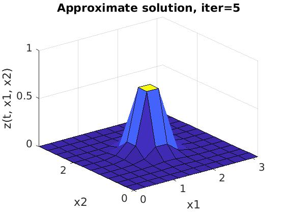
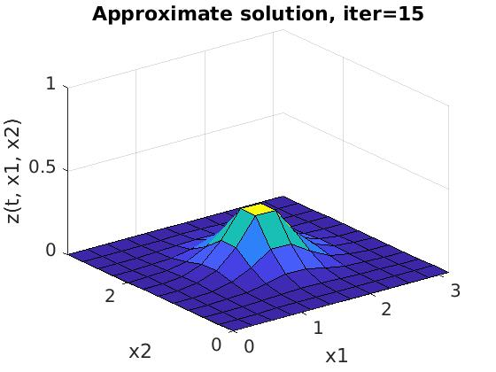
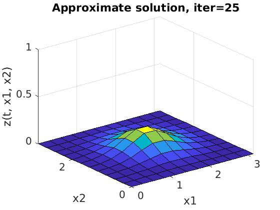
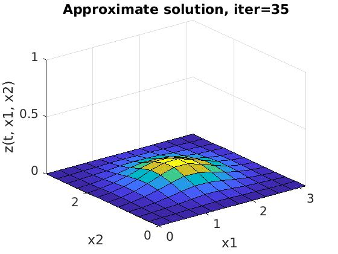
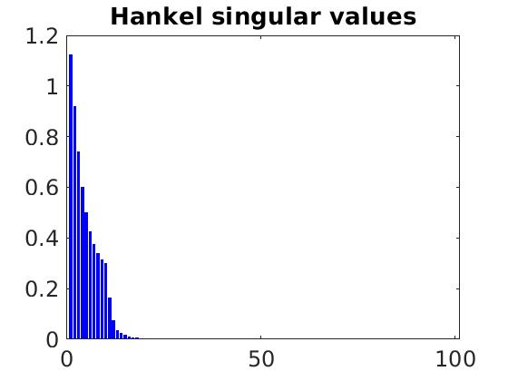
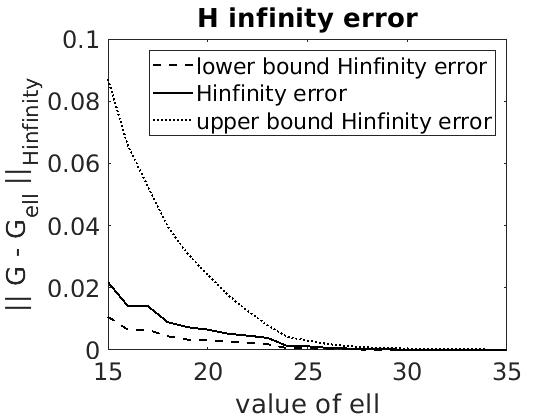
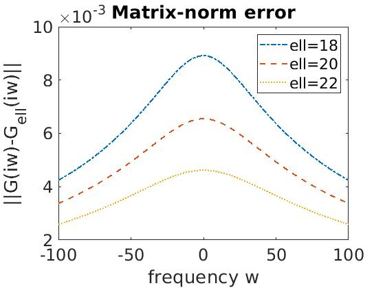

# Balanced_truncation_2018
For the 2d heat equation (with boundary control and Neumann observation) as a toy example, implementation of a Model Order Reduction method *Balanced truncation method* using the Control system toolbox of Matlab.

**Reference:** Model order reduction via balanced truncation and proper orthogonal decomposition, Charlotte Rodriguez (Master Thesis).
* Available in this folder: Master-Thesis.pdf
* See also the slides: slides-oct-2018.pdf

**Some pictures:**
* approximate solution

&nbsp;&nbsp;&nbsp;&nbsp;&nbsp;&nbsp;   

&nbsp;&nbsp;&nbsp;&nbsp;&nbsp;&nbsp;  

* Hankel singular values and error estimates

&nbsp;&nbsp;&nbsp;&nbsp;&nbsp;&nbsp;   
